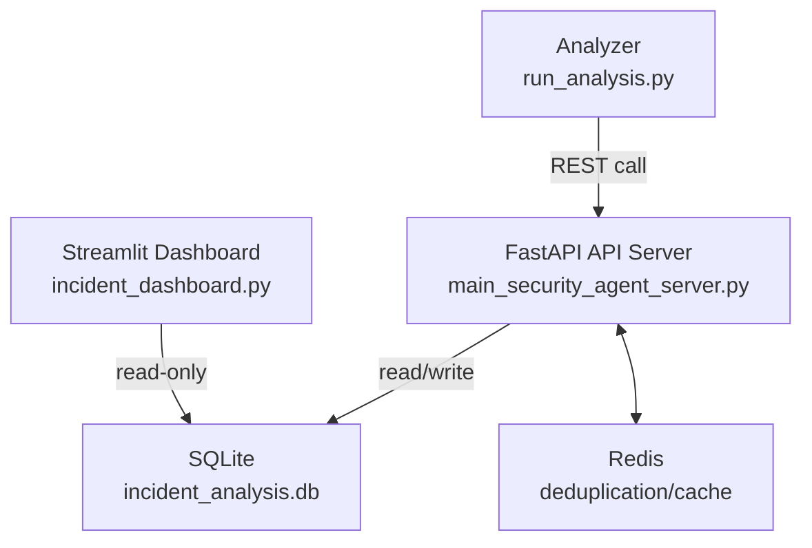

# RAD Security: AI-Powered CVE Analysis Agent 🛡️

[](https://www.python.org/downloads/)
[](https://fastapi.tiangolo.com)
[](https://github.com/hwchase17/langchain)
[](https://github.com/psf/black)

A sophisticated AI agent system designed to automate and augment the triage and escalation process for security incidents. It uses semantic CVE matching, LLM-driven risk reasoning, and persistent analysis records to create a scalable cybersecurity co-pilot. 

## 🌟 Key Features

- **Semantic CVE Matching**: Uses FAISS-based vector stores for similarity search across KEV, NVD, and historical incident data.
- **LLM-Guided Analysis**: Incorporates OpenAI’s GPT-4o-mini to interpret incident context and assign contextualized risk levels.
- **Persistent Learning**: Stores risk assessments in SQLite and vectorizes them for future context injection.
- **Agent Modularity**: ReAct-based LangChain agent with separation of tools, memory, and execution loop.
- **Idempotent API Design**: Server enforces deduplication of requests by `request_id` to ensure reproducible behavior.
- **Tool Isolation**: Retrieval logic lives in a separate `mcp_cve_server.py` tool endpoint, isolating the agent's decision logic from data access.

## 🏗️ Architecture

```
┌─────────────────────────────────┐
│          Client Layer           │
│ (Notebook, run_analysis.py)     │
└────────────────┬────────────────┘
                 │
┌────────────────▼────────────────┐
│        API Service Layer        │
│ (main_security_agent_server.py) │
└────────────────┬────────────────┘
                 │
┌────────────────▼────────────────┐
│        Agent Layer              │
│ (LangChain, LangGraph, ReAct)   │
└────────────────┬────────────────┘
                 │
┌────────────────▼────────────────┐
│        Tools Layer              │
│ (MCP Server, mcp_cve_server.py) │
└────────────────┬────────────────┘
                 │
┌────────────────▼────────────────┐
│        Storage Layer            │
│ (FAISS, Redis, SQLite)          │
└─────────────────────────────────┘
```

### 🧭 Architecture Overview (Service-Level)

<details>
<summary>Click to expand architecture diagram</summary>


</details>

## Project Structure

```
.
├── .dockerignore                          # Excludes venv, __pycache__, logs, data backups, etc.
├── Dockerfile                             # Sets up FastAPI environment and app code
├── docker-compose.yml                     # Spins up Redis, FastAPI, analyzer, dashboard
│
├── main_security_agent_server.py           # FastAPI API server coordinating analysis requests
│   ├── Enforces idempotency via request_id
│   ├── Config-driven defaults (batch_size, model_name, redis URL, etc.)
│   └── Logs run metadata and output token usage
├── mcp_cve_server.py                       # Tool server providing CVE search, schema lookup, and risk normalization tools
│   ├── Decorated with @timing_metric and @cache_result
│   └── Retrieval logic isolated from agent execution
├── run_analysis.py                         # CLI script that sends incident batches to the API server
├── data/                                   # Input datasets and vector stores
│   ├── incidents.json                      # Input security incidents
│   ├── kev.json                            # Known Exploited Vulnerabilities
│   ├── nvd_subset.json                     # National Vulnerability Database subset
│   └── vectorstore/                        # FAISS vector indexes (NVD, KEV, incident history)
├── setup/                                  # Initialization scripts
│   ├── download_cve_data.py                # Downloads and filters CVE datasets
│   ├── build_faiss_KEV_and_NVD_indexes.py  # Builds KEV/NVD vector indexes
│   ├── build_historical_incident_analyses_index.py  # Builds vector index from dummy historical incidents
│   └── setup_initial_CVE_data_and_FAISS_indexes.sh  # Shell wrapper to run all setup steps
└── utils/                                  # Support modules
    ├── retrieval_utils.py                  # Embedding, FAISS search, reranking via MMR
    ├── flatteners.py                       # JSON → string transformation for embedding input
    ├── prompt_utils.py                     # Prompt templates and output schemas
    ├── datastore_utils.py                  # SQLite persistence of runs and incident metadata
    └── decorators.py                       # Timing and caching decorators for observability
```

## 🚀 Getting Started

1. **Clone the Repository**
   ```bash
   git clone https://github.com/dguilliams3/mcp-agentic-security-escalation.git
   cd mcp-agentic-security-escalation
   ```

2. **Install Dependencies**
   ```bash
   pip install -r requirements.txt
   ```

3. **Initialize Environment**
   ```bash
   docker run -d --name local-redis -p 6379:6379 redis:latest
   sh setup/setup_initial_CVE_data_and_FAISS_indexes.sh
   ```

4. **Run the System**
   - Start the FastAPI server:
     ```bash
     python main_security_agent_server.py
     ```
   - Execute batch analysis via:
     ```bash
     python run_analysis.py
     ```

## 🐳 Dockerized Deployment (Optional)

Launch all services in one go:
```bash
docker compose up --build
```
This will start:
- Redis (caching layer)
- FastAPI API server (port `8000`)
- Analyzer (runs `run_analysis.py`)
- Streamlit dashboard (available at `http://localhost:8501`)

Includes named volumes for persistent data:
- `redis-data`, `sqlite-data`, and optional `cve-data`

Each service has healthchecks and startup ordering enforced.

## 💡 How It Works

1. **Incident Preprocessing**: Incidents are flattened, embedded, and semantically matched to CVEs.
2. **CVE Matching**: FAISS indexes return high-relevance matches based on KEV/NVD text similarity.
3. **Risk Assessment**: LLM scores each CVE-incident pairing, injecting historical analysis as additional context.
4. **Tool Calls**: Tools are used selectively based on agent reasoning, including schema validation and reranking.
5. **Structured Output**: Results are written to SQLite and optionally re-indexed for vector-based feedback learning.

## 🔍 Example Output

```json
{
  "incident_id": "INC-2023-08-01-001",
  "incident_summary": "VPN Gateway unauthorized access attempt",
  "incident_risk_level": 0.85,
  "incident_risk_level_explanation": "High risk due to successful VPN compromise...",
  "cve_ids": [
    {
      "cve_id": "CVE-2023-1234",
      "cve_summary": "Authentication bypass in Cisco IOS XE...",
      "cve_relevance": 0.92,
      "cve_risk_level": 0.88
    }
  ]
}
```

## 📈 Performance Metrics

- Average end-to-end time per incident: **< 20 seconds**
- Full concurrency across batches supported via asyncio + FastAPI
- Dockerized deployment supports modular rollout, shared DB access, and dashboard monitoring

## 🛠️ Developer Notes

- **Type Safety**: Pydantic schemas ensure response format validation
- **Observability**: Decorators log latency, cache usage, and API calls per tool
- **Extensibility**: Easily swap out vector DBs, LLM endpoints, or caching backends

## 📝 License

MIT License. See [LICENSE](LICENSE).

## 🙏 Acknowledgments

- OpenAI (GPT-4o)
- CISA & NIST for public CVE and KEV datasets
- LangChain for tooling abstraction and orchestration support

Built with ❤️ by [Dan Guilliams](https://github.com/dguilliams3) 


